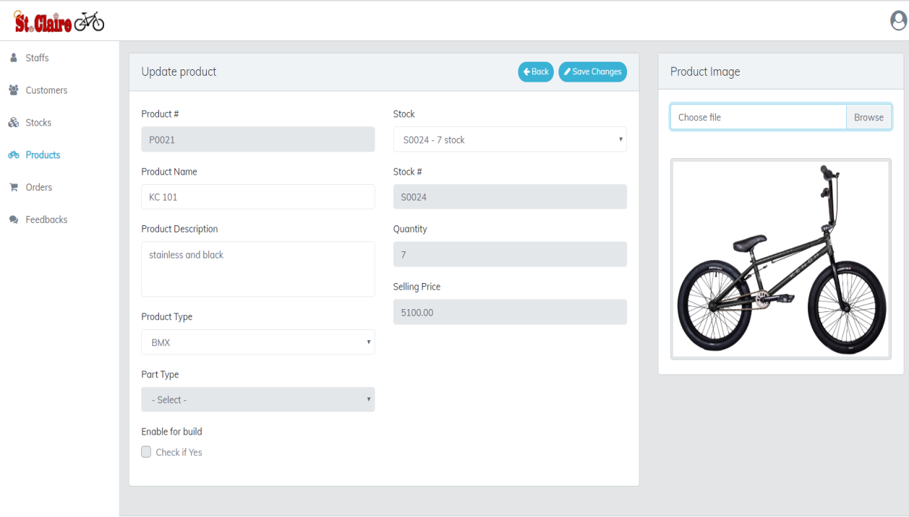

## About The Project

An E-Commerce platform for Bicycle where customers can effortlessly navigate through a diverse product catalog, personalize their bikes, and securely complete transactions using credit or debit cards, all while accessing their transaction records.

### Built With

-   ![JavaScript][JavaScript-badge]
-   ![NodeJS][NodeJS-badge]
-   ![Expressjs][Expressjs-badge]
-   ![jQuery][jQuery-badge]
-   ![MongoDB][MongoDB-badge]
-   ![CSS3][CSS3-badge]
-   ![Bootstrap][Bootstrap-badge]
-   ![PayPal][PayPal-badge] (payment provider)

## Features

#### Administrator / Staff account

-   Staff management for resource tracking.
-   Product catalog management for product listings, including detailed descriptions, images, specifications, and price.
-   Inventory management enabling administrator / staff to monitor and manage product stock levels, and track inventory movements to ensure adequate product availability.
-   Order approval and transaction monitoring for order status and transaction progress.
-   Generate and export detailed reports on income, sales, and inventory, providing valuable insights for decision-making

#### Customer account

-   Browse bike and bike accessories catalog.
-   Bike customization feature enabling customers to personalize their bikes by selecting desired bike parts and accessories.
-   Seamlessly proceed to checkout and place orders for bikes and accessories online, with integrated online payment gateway options allowing for secure credit/debit card transactions
-   Order monitoring allowing customers to track the progress of their purchases from placement to delivery.
-   View past purchase history for easy reference and reordering
-   Generate detailed electronic invoices for every purchase, including itemized lists of purchased products, prices, and payment details

## Screenshots

### Administrator / Staff account

-   #### Products monitoring

    

-   #### Product management
    

### Customer account

-   #### Bike and accessories catalog

    

-   #### Bike customization
    

<!-- MARKDOWN LINKS & IMAGES -->
<!-- https://www.markdownguide.org/basic-syntax/#reference-style-links -->

[React-Query-badge]: https://img.shields.io/badge/-React%20Query-FF4154?style=for-the-badge&logo=react%20query&logoColor=white
[TypeScript-badge]: https://img.shields.io/badge/typescript-%23007ACC.svg?style=for-the-badge&logo=typescript&logoColor=white
[React-badge]: https://img.shields.io/badge/react-%2320232a.svg?style=for-the-badge&logo=react&logoColor=%2361DAFB
[Chakra-badge]: https://img.shields.io/badge/chakra-%234ED1C5.svg?style=for-the-badge&logo=chakraui&logoColor=white
[CSS3-badge]: https://img.shields.io/badge/css3-%231572B6.svg?style=for-the-badge&logo=css3&logoColor=white
[SASS-badge]: https://img.shields.io/badge/SASS-hotpink.svg?style=for-the-badge&logo=SASS&logoColor=white
[Firebase-badge]: https://img.shields.io/badge/firebase-a08021?style=for-the-badge&logo=firebase&logoColor
[Bootstrap-badge]: https://img.shields.io/badge/bootstrap-%238511FA.svg?style=for-the-badge&logo=bootstrap&logoColor=white
[JavaScript-badge]: https://img.shields.io/badge/javascript-%23323330.svg?style=for-the-badge&logo=javascript&logoColor=%23F7DF1E
[NextJS-badge]: https://img.shields.io/badge/Next-black?style=for-the-badge&logo=next.js&logoColor=white
[NodeJS-badge]: https://img.shields.io/badge/node.js-6DA55F?style=for-the-badge&logo=node.js&logoColor=white
[MUI-badge]: https://img.shields.io/badge/MUI-%230081CB.svg?style=for-the-badge&logo=mui&logoColor=white
[Expressjs-badge]: https://img.shields.io/badge/express.js-%23404d59.svg?style=for-the-badge&logo=express&logoColor=%2361DAFB
[jQuery-badge]: https://img.shields.io/badge/jquery-%230769AD.svg?style=for-the-badge&logo=jquery&logoColor=white
[PayPal-badge]: https://img.shields.io/badge/PayPal-00457C?style=for-the-badge&logo=paypal&logoColor=white
[MongoDB-badge]: https://img.shields.io/badge/MongoDB-%234ea94b.svg?style=for-the-badge&logo=mongodb&logoColor=white
